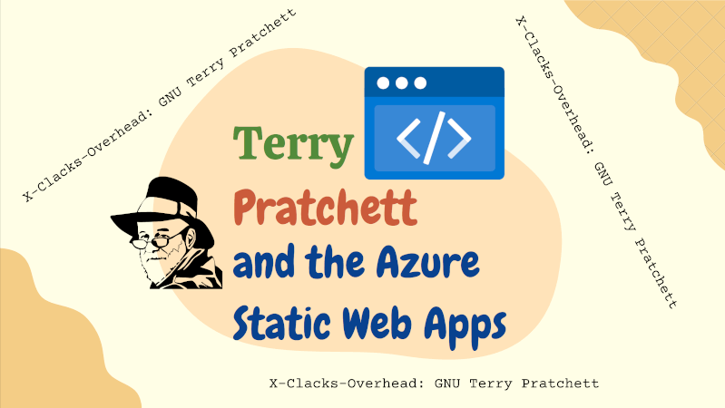

The Web Monetization API is a JavaScript browser API that allows the creation of a payment stream from the user agent to the website. This post walks through getting started adding it to a site.

## The Web Monetization API

I recently attended the [HalfStack at the Beach](https://halfstackconf.com/newquay/) conference and heard a talk from [Alex Lakatos](https://twitter.com/avolakatos) on the Web Monetization API. I hadn't heard about this previously, but my rough understanding of the concept was that it was a way to monetize a website. My blog already features a [Buy Me a Coffee](https://www.buymeacoffee.com/qUBm0Wh) link, which allows generous people to send me small amounts of money if they've found something I've written useful. The Web Monetization API appears to be that, but built into the browser and proposed proposed as a W3C standard at the [Web Platform Incubator Community Group](https://discourse.wicg.io/t/proposal-web-monetization-a-new-revenue-model-for-the-web/3785).

I was intrigued. Alex was kind enough to share some links with me, and I decided to take the Web Monetization API for a spin, and see what it was like. So this post is going to be exactly that. I'm a noob; I don't know how to use the Web Monetization API (or much about it TBH). Over the course of this post I'll try and integrate it into my blog. As I do that I'll share what I'm doing and how I found things; to try to provide a useful resource (and some feedback) on what adoption feels like.

## Getting started
